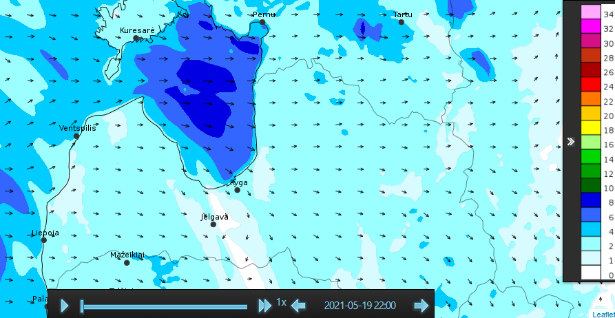
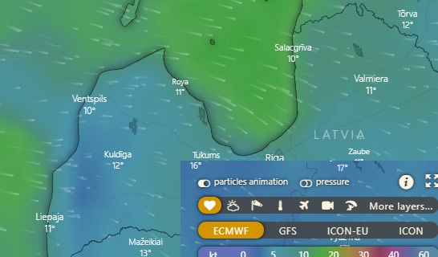
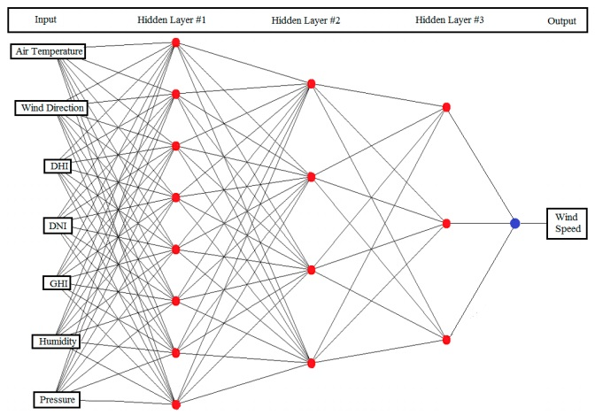

# Analysis and prediction of wind flows in the Baltic States

It is my final project for the Building AI course. In it, I would like to share my thoughts on creating a new resource that could help analys and predict of wind flows in the Baltic States with help AI methods. 

## Summary

My project is to find the optimal AI model which can help the most accurate forecast of wind strength and direction in the Baltic States. It is necessary to study the existing models that are used for wind forecast in other regions and try to optimize it for our region.

## Background

There are many models for predicting weather conditions. So are the wind currents and their strength. But as my personal observations show, in our region they are not accurate enough.I have been kitesurfing for the third year already and forecasting the strength and direction of the wind is very important for me in my hobby. I faced the problem that world leaders in this area, such as for example Windguru or Windy not accurate enough in the Baltic Sea region. The ultimate goal of my project is to improve the model, with an AI model that can more accurately predict in the short term.

## How is it used?

Ultimately, having created a model and having the ability to visualize it in the short term, it can be interesting not only for kitesurfers, but also for windsurfers, sailors, fishermen and many other users.

Ultimately, the final rendering may look different. But there should be a windy scale in it, which will show the strength and direction of the wind for several days in advance.
It will look something like this:

## Data sources and AI methods
To create our first model, we will need the following input data:
- air temperature
- wind direction
- direct normal irradiation (DNI) 
- the diffuse horizontal irradiation (DHI)
- the global horizontal irradiation (GHI)
- humidity
- pressure

I want to note that this is our first experience in this area and perhaps some parameters will be replaced or excluded in the future. Or the model itself can be simplified.

The model will look like this:

## Challenges

Unfortunately, we have not yet solved the problem of prompt collection of all the data that we need to build a model. 

## What next?

In the future, we need to find an opportunity to quickly pump up all the necessary input parameters in real time. Make a beta version of the program and at least for a few months compare its results with real data.

## Acknowledgments

* I would like to express my gratitude to the researcher from Energy Research Lab, College of Engineering, Effat University, P.O. Box 34689, Jeddah 21478, Saudi Arabia, Tayeb Brahimi, whose scientific work inspired me to further explore this interesting topic.
